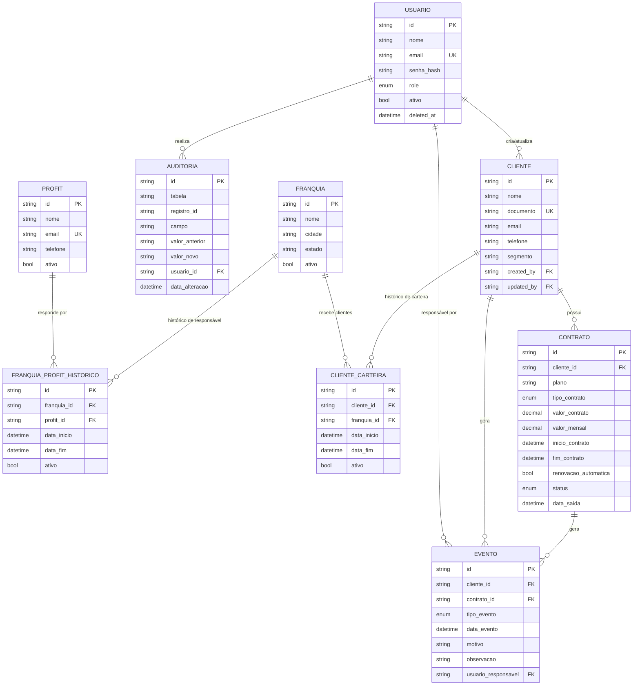

# Diagrama ERD — AlphaHUB Comercial

Gerado a partir de `prisma/schema.prisma`. Ver também `prisma/migrations/0001_init/migration.sql` para o DDL aplicado.

## Decisões de modelagem

- **Cliente não guarda franquia atual.** A franquia corrente de um cliente é sempre `cliente_carteira` com `ativo = true` e `data_fim = null`. Trocar de franquia = encerrar o registro ativo (`data_fim`) + criar um novo.
- **Franquia não guarda Profit atual.** Mesmo padrão via `franquia_profit_historico`.
- **Contrato tem status próprio** (`ATIVO/PAUSADO/ENCERRADO/CHURN`) além dos eventos — o status é o estado atual "materializado"; o evento é o registro histórico e auditável de *por que* ele mudou.
- **Soft delete:** todas as tabelas de entidade (não as de histórico/evento/auditoria) têm `deleted_at`. Nenhum dado é removido fisicamente, conforme especificado.
- **IDs:** `cuid()` em vez de auto-increment, para IDs não sequenciais/não adivinháveis e seguros para geração distribuída (import em lote, múltiplos ambientes).
- **Money:** `Decimal(14,2)` para `valor_contrato`/`valor_mensal` — nunca `Float`, para evitar erro de arredondamento em somas de MRR.
